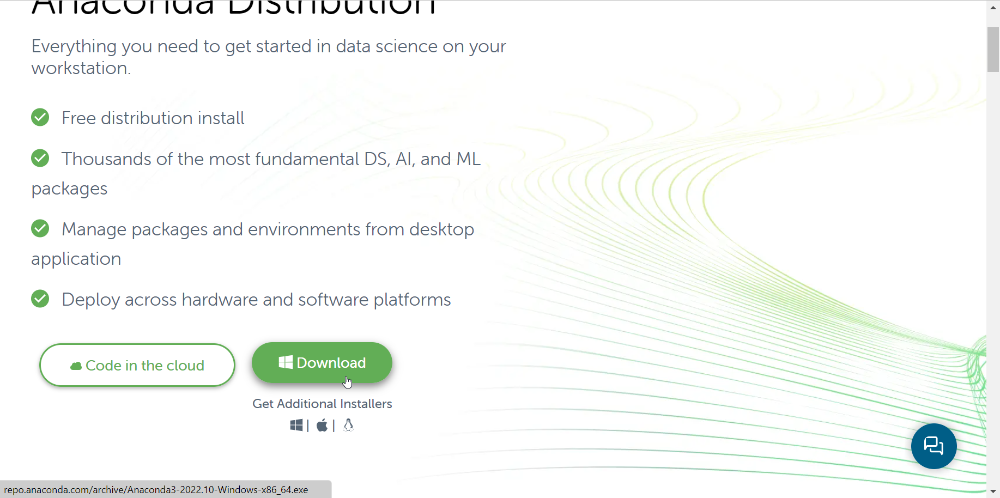
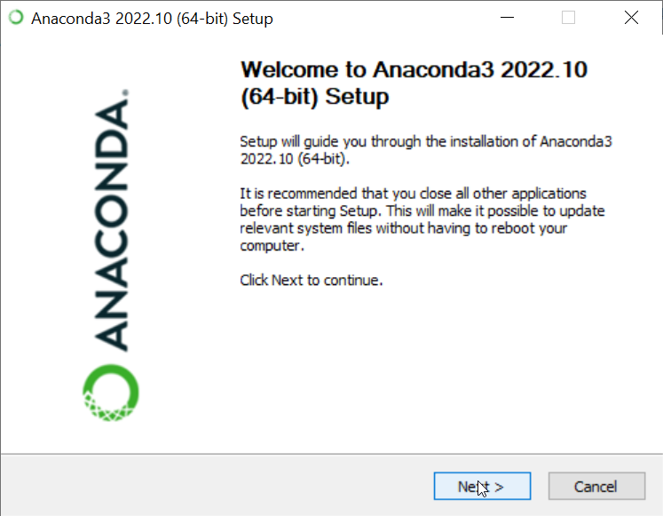
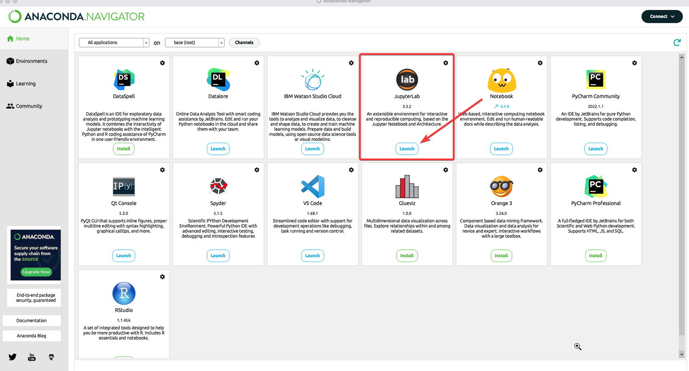

# Python 101 or How to start talking to a snake in 3 hours?

## Background
Learning programming is rather challenging. There are so many programming languages, so many frameworks, so many libraries, so many IDEs, so many concepts, so many things to learn. It is easy to get lost in the sea of information :shrug:.

What is the way out? The answer is simple: **start with Python** :snake:. Python is a general-purpose programming language that is becoming more and more popular in the data science community. It is easy to learn, it is :free:, it is open-source, it is cross-platform, it is powerful, it is flexible, it is fun.

One of the core advantages of Python is that it has a **huge community** :people_holding_hands:. This means that there are a lot of resources available online. You can find a lot of tutorials, courses, books, and videos. Besides that, it has a great collection of **packages** :package: for data science and machine learning. For example, **Pandas** is a library for data manipulation and analysis. It provides high-performance, easy-to-use data structures and data analysis tools. **scikit-learn** is a library for machine learning in Python. It has a wide range of supervised and unsupervised learning algorithms via a consistent interface in Python.

## What topics are we going to cover?
1. What is Python, and what can it do?
2. How to program in Python?
3. Variables: types, names, and values;
4. Operators: arithmetic, comparison, and logical;
5. Conditional statements: `if`, `elif`, and `else`;
6. Loops: `for` and `while`;
7. Basics data structures: lists, tuples, and dictionaries;
8. Graphs: matplotlib;
9. Extra: sneak peek into Pandas and scikit-learn.

## How are we going to do it?
We're going to have four sessions, each one of them will be 40 minutes long. The last session will be 30 minutes long. We'll have 5 minutes break between each session. Here is a more detailed schedule:

| Session | Topic | Duration |
| --- | --- | --- |
| 1 | What is Python, and what can it do? | 40 min |
| 2 | Operators and conditionals | 40 min |
| 3 | Loops and data structures | 40 min |
| 4 | Graphs and sneak peak into Pandas and scikit-learn | 30 min |

## How to get started?
We are going to use **Anaconda Distibution**. It is a **free** and open-source distribution of the Python and R programming languages for scientific computing, that aims to simplify package management and deployment. The distribution includes **data-science packages** suitable for **Windows, Linux, and macOS**. It is the easiest way to start performing Python/R data science and machine learning on a single machine.

We are going to work in **Jupyter Lab**, which is a web-based interactive development environment for Jupyter notebooks, code, and data. It enables you to create and share documents that contain live code, equations, visualizations and narrative text. Later on you might explore other IDEs, such as **PyCharm**, **Spyder** or **Visual Studio Code**. 

To install Anaconda Distribution follow the steps below:

1. Download Anaconda Distribution from [here](https://www.anaconda.com/download/).
<p align="center">
    
</p>
1. Click on the downloaded file and follow the instructions.
<p align="center">
    
</p>

1. Open Anaconda Navigator and launch Jupyter Lab.
<p align="center">
    
</p>

## Workshop materials
We are going to use Jupyter Notebooks. You can find the workshop materials in this repository. To download the repository click on the green button **Clone or download** and then **Download ZIP**. After downloading the repository, unzip it and open the folder in Jupyter Lab.

## Repo structure
```
├── images           <- images used in the README.md and main.ipynb
├── answers.ipynb    <- answers to the exercises
├── main.ipynb       <- this workshop
├── main.slides.html <- slides of the workshop
├── exercises.ipynb  <- exercises
├── README.md        <- this file
```
## Authors
[Auriane Tecourt](https://github.com/AurianeTec), [Marya Malki](https://github.com/maryamalki) and [Mikhail Sirenko](https://github.com/mikhailsirenko).